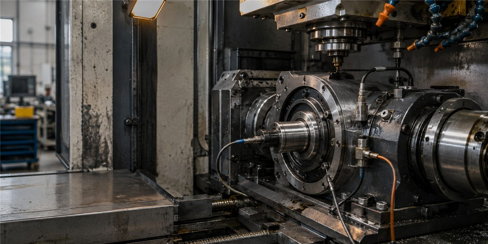
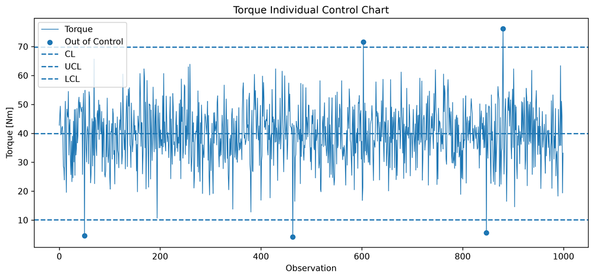
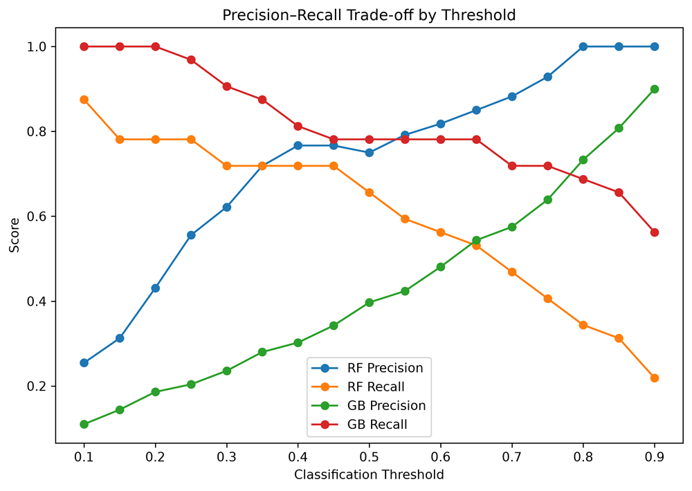
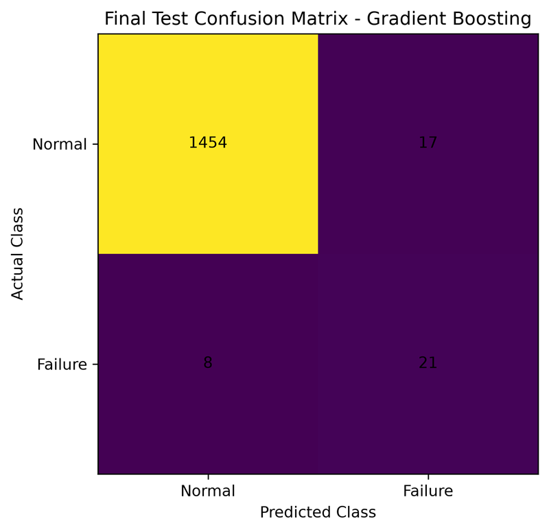
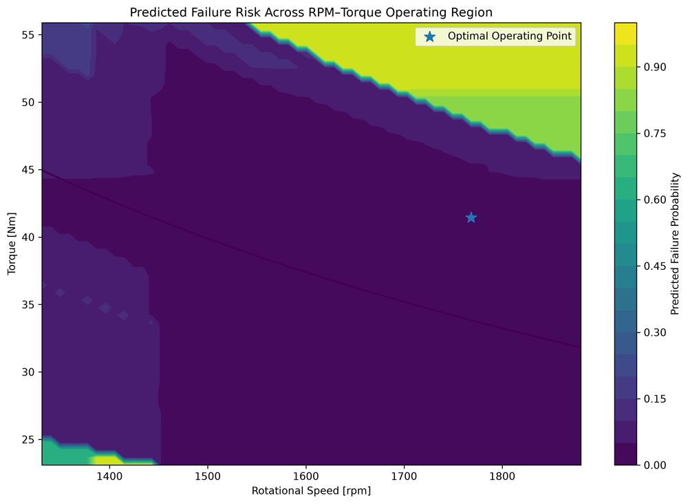

# 위험기반 예지보전 의사결정 프레임워크

> 통계적 공정관리(SQC)로 이상을 감지하고, 머신러닝(ML)으로 고장위험을 추정한 뒤, 제약 최적화로 운전 의사결정까지 연결한 독립 연구

**신도윤 · 가천대학교 산업공학과**  
Independent undergraduate research manuscript · 2026

[국문 논문 바로 읽기](papers/read-ko.md) · [English paper](papers/read-en.md) · [국문 PDF](papers/risk-aware-predictive-maintenance-ko.pdf) · [English PDF](papers/risk-aware-predictive-maintenance-en.pdf) · [분석 코드 저장소](https://github.com/doyunsin883-debug/risk-aware-predictive-maintenance)



## 이 연구를 세 문장으로 설명하면

1. **SQC**로 “공정이 평소와 다른가?”를 확인한다.
2. **ML**로 “이 상태가 실제 고장으로 이어질 가능성이 높은가?”를 추정한다.
3. **최적화**로 “그렇다면 생산성을 지키면서 어떻게 운전할 것인가?”를 탐색한다.

즉, **SQC는 공정 상태를 설명하고, ML은 고장위험을 예측하며, 최적화는 그 예측을 행동으로 바꾼다.** 이 저장소는 그 연결 논리를 논문, 그림, 쉬운 해설의 세 층으로 정리한다.

## 처음 방문했다면

| 보고 싶은 것 | 추천 경로 | 예상 시간 |
|---|---|---:|
| 연구가 무슨 이야기인지 빠르게 이해 | [비전공자를 위한 쉬운 해설](docs/EASY_GUIDE_KO.md) | 5분 |
| 분석 순서와 판단 근거 확인 | [연구 흐름과 의사결정 지도](docs/RESEARCH_FLOW_KO.md) | 10분 |
| 핵심 수치만 검토 | [결과 한눈에 보기](docs/RESULTS_AT_A_GLANCE.md) | 3분 |
| 논문 전체 읽기 | [국문 모바일 리더](papers/read-ko.md) | 25–35분 |
| 영문 원고 검토 | [English mobile reader](papers/read-en.md) | 25–35 min |
| 재현 코드 실행 | [분석 코드 저장소](https://github.com/doyunsin883-debug/risk-aware-predictive-maintenance) | 별도 |

## 전체 연구 흐름

```mermaid
flowchart LR
    A["AI4I 2020<br/>10,000개 관측치"] --> B["EDA·데이터 감사<br/>불균형·라벨 정합성 확인"]
    B --> C["순차 분할<br/>Train 70% · Validation 15% · Test 15%"]
    C --> D["SQC<br/>I-MR 관리도와 드리프트 진단"]
    D --> E["특성 설계<br/>원변수 + 공학 특성 + SPC 신호"]
    E --> F["ML 비교<br/>Logistic · RF · GB"]
    F --> G["검증구간 임계값 선택<br/>0.65"]
    G --> H["보류 테스트<br/>최종 성능·고장유형 진단"]
    H --> I["제약 최적화<br/>생산성 조건 아래 위험 탐색"]
    I --> J["운영 의사결정<br/>경보·점검·운전 후보"]
```



여기서 중요한 것은 기법을 나열한 것이 아니라 **각 단계가 다음 단계의 판단 근거가 되도록 설계했다는 점**이다. 관리도 경보를 곧바로 고장으로 간주하지 않았고, 검증 데이터에서 모델과 임계값을 선택한 뒤 마지막 테스트 구간은 최종 평가에만 사용했다.

## 데이터와 실험 설계

- 데이터: **AI4I 2020 Predictive Maintenance Dataset**, 관측치 10,000개
- 목표변수: `Machine failure`
- 전체 고장: **339건(3.39%)** — 정확도만으로는 모델을 평가하기 어려운 불균형 문제
- 데이터 감사: 전체 고장 라벨과 세부 고장모드 사이의 **정합성 예외 27건** 확인
- 분할 방식: 무작위 분할이 아닌 관측 순서 기준 **70/15/15 순차 분할**

| 구간 | 관측치 | 고장 | 역할 |
|---|---:|---:|---|
| Train | 7,000 | 278 | 관리한계·모델 학습 |
| Validation | 1,500 | 32 | 모델·임계값 선택 |
| Test | 1,500 | 29 | 최종 일반화 평가 |

순차 분할은 시간 정보가 완전한 산업 시계열은 아니라는 한계가 있지만, 미래 정보를 섞는 무작위 분할보다 배포 상황에 가까운 평가를 제공한다.

## 1. SQC: 이상은 찾되, 고장이라고 단정하지 않는다

개별값–이동범위(I-MR) 관리도로 토크, 기계동력, 온도차를 살폈다. I 관리도는 현재 수준의 이탈을, MR 관리도는 인접 관측치 사이의 급격한 변화를 보여준다.



검증구간에서 토크 경보율은 **1.33%**, 경보집단 고장률은 **20.0%**, 위험도 상승배수는 **9.38배**였다. 기계동력도 경보율 **1.47%**, 경보집단 고장률 **18.18%**, 상승배수 **8.52배**를 보였다. 경보가 드물지만 울릴 때는 의미가 있었다.

다만 토크 관리도는 검증구간 고장 32건 중 약 4건만 포착했다. 이는 SQC가 **선택적인 이상 탐지기**이지 모든 고장을 포괄하는 분류기가 아니라는 뜻이다.

온도차는 더 중요한 반례를 제공했다. 검증구간의 경보율이 **96.13%**였지만 위험도 상승배수는 **0.98배**에 그쳤다. 학습 평균 9.61 K에서 검증 평균 10.92 K로 공정 기준선이 이동했기 때문이다. 따라서 온도차 경보는 고장 예측변수에서 제외하고 **드리프트 신호**로 해석했다.

## 2. ML: 연속값이 있는데 경보 플래그가 더 필요한가

세 가지 특성 집합을 비교했다.

| 집합 | 구성 | 질문 |
|---|---|---|
| A | 원래 센서·운전 변수 | 기본 정보만으로 어디까지 가능한가 |
| B | A + 온도차 + 기계동력 | 공학적 파생특성이 도움이 되는가 |
| C | B + 토크·동력·RPM SPC 경보 | 관리도 경보가 추가 예측력을 주는가 |

특성 집합 B는 A보다 개선됐지만 C는 재현율이 조금 오르는 대신 PR-AUC가 개선되지 않았고, SPC 경보 변수의 중요도도 거의 0에 가까웠다. **연속 센서값과 파생특성이 이미 포함되면 이진 경보 플래그가 추가 순위정보를 거의 제공하지 않는다**는 음의 결과다. 이 연구에서 SQC의 가장 큰 가치는 ML 입력 확장이 아니라 공정 해석과 드리프트 진단이었다.



검증 결과 비선형 모델인 Random Forest와 Gradient Boosting이 로지스틱 회귀를 앞섰다. 최종 모델은 고장 누락 비용을 고려해 Gradient Boosting으로 정하고, 검증구간에서 임계값 **0.65**를 선택했다.

## 3. 보류 테스트: 선택이 끝난 뒤 한 번만 평가한다

| 지표 | 최종 테스트 결과 |
|---|---:|
| Accuracy | 0.9833 |
| Precision | 0.5526 |
| Recall | 0.7241 |
| F1-score | 0.6269 |
| ROC-AUC | 0.9615 |
| PR-AUC | 0.7463 |



테스트 고장 29건 중 **21건을 탐지**하고 8건을 놓쳤으며, 정상 1,471건 중 17건을 경보했다. 고장유형별로는 TWF 1/7, PWF 7/7, OSF 16/17을 포착했다. 전체 재현율 하나만 보고 끝내지 않고, 어떤 고장에 강하고 약한지를 별도로 확인했다.

## 4. 최적화: 예측값을 운전 후보로 바꾼다

회전속도와 토크를 의사결정변수로 두고, 기계동력 하한을 생산성 제약으로 설정했다. 60×60 격자의 3,600개 후보 중 1,999개가 제약을 만족했다.



대표 결과는 약 **1,768 rpm, 41.45 Nm, 7.68 kW**, 모델 점수 **1.3046%**였다. 그러나 이는 관측자료와 고정된 다른 변수, 제한된 격자 안에서 찾은 **조건부 후보점**이다. 물리적 인과관계를 입증한 보편적 최적 운전점으로 해석해서는 안 된다.

공구마모 약 202.7분 부근에서 위험점수가 급변한 현상도 “203분에 반드시 교체”라는 물리 법칙이 아니다. 트리 모델의 분할구조가 만든 정책 경계이므로, 실제 교체주기는 비용·점검능력·안전여유와 함께 결정해야 한다.

## 이 연구가 남기는 결론

- **관리도 경보와 고장 라벨은 같은 것이 아니다.** 이상은 정밀검사 대상을 좁히는 신호다.
- **희귀고장 문제에서는 정확도보다 PR-AUC와 재현율이 중요하다.** 임계값도 비용과 목적에 따라 별도로 선택해야 한다.
- **음의 결과도 설계 지식이다.** SPC 플래그가 ML을 개선하지 않았다는 사실은 중복 특성 설계를 줄여준다.
- **예측은 결정이 아니다.** 생산성 제약과 운영비용을 함께 다뤄야 모델이 현장 행동으로 이어진다.
- **최적화 결과는 후보이지 명령이 아니다.** 현장 검증과 인과적·물리적 검토가 뒤따라야 한다.

## 두 핵심 저장소의 역할

| 핵심 저장소 | 담당 역할 | 무엇을 확인할 수 있나 |
|---|---|---|
| **현재 저장소 — Paper** | 연구 질문, 논증, 결과, 한·영 원고 | 왜 이 분석을 했고 무엇을 주장할 수 있는가 |
| **[Companion Code](https://github.com/doyunsin883-debug/risk-aware-predictive-maintenance)** | 노트북, 데이터, 모델 산출물, 재현 절차 | 수치와 그림이 어떻게 만들어졌는가 |

두 저장소는 분리되어 있지만 하나의 연구를 구성한다. 이곳에서 논리를 읽고, 코드 저장소에서 계산을 검증하는 흐름을 권장한다.

## 저장소 구조

```text
.
├── papers/                  # 한·영 PDF와 모바일 페이지 리더
├── docs/                    # 쉬운 해설, 연구 흐름, 핵심 결과표
├── assets/
│   ├── figures/             # README 핵심 그림
│   └── paper-preview/       # 휴대전화용 페이지 이미지
├── scripts/                 # 링크·파일 구조 검증
├── CITATION.cff             # 논문 인용 메타데이터
└── README_EN.md             # English landing page
```

## 인용

> Shin, D. (2026). *A Risk-Aware Predictive Maintenance Decision Framework: From Statistical Process Control and Nonlinear Failure Prediction to Constrained Operating Decisions*. Independent undergraduate research manuscript, Department of Industrial Engineering, Gachon University.

BibTeX와 인용 가능한 메타데이터는 [CITATION.cff](CITATION.cff)에서 확인할 수 있다.

## 연구 범위와 AI 사용 고지

이 원고는 동료평가를 거치지 않은 개인 독립연구이며, AI4I 2020 공개 합성데이터에 대한 사례연구다. 실제 설비에 적용하려면 시간정보가 포함된 현장 데이터, 외부검증, 비용기반 임계값 설계, 물리·안전 제약 검토가 추가로 필요하다.

연구 과정에서 생성형 AI는 **분석 코드 구현과 디버깅을 보조하는 도구**로 사용되었다. 이 공개 저장소를 정리하는 과정에서는 문서 구조와 표현을 점검하는 보조도구로 활용했다. 연구 질문, 데이터 해석, 수치 검증, 주장과 결론에 대한 최종 책임은 저자에게 있다.

---

© 2026 Doyun Shin. 원고와 도표의 이용 조건은 [RIGHTS.md](RIGHTS.md)를 따른다.
