# 국문 논문 · 모바일 리더

**위험기반 예지보전 의사결정 프레임워크**  
통계적 공정관리, 비선형 고장예측 및 제약 최적화를 결합한 제조설비 의사결정 연구

신도윤 · 가천대학교 산업공학과 · 개인 독립연구 · 2026

[원본 PDF 내려받기](https://github.com/doyunsin883-debug/risk-aware-predictive-maintenance-paper/releases/download/v1.0.0/risk-aware-predictive-maintenance-ko.pdf) · [쉬운 해설](../docs/EASY_GUIDE_KO.md) · [메인으로 돌아가기](../README.md)

아래 이미지는 휴대전화에서도 GitHub 앱과 브라우저로 읽을 수 있도록 PDF를 페이지별로 변환한 미리보기다. 인용·인쇄에는 위 PDF를 사용한다.

## 1쪽

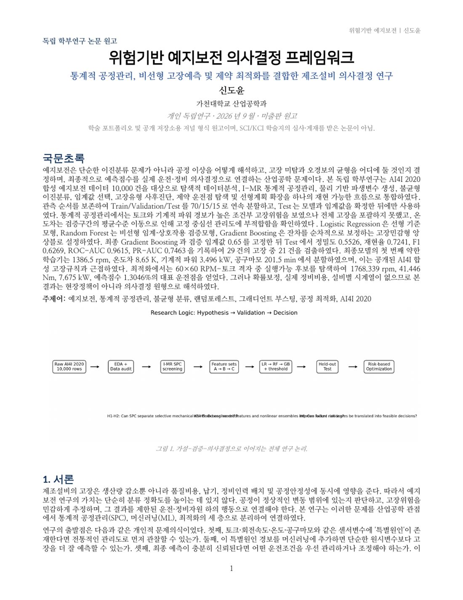

## 2쪽

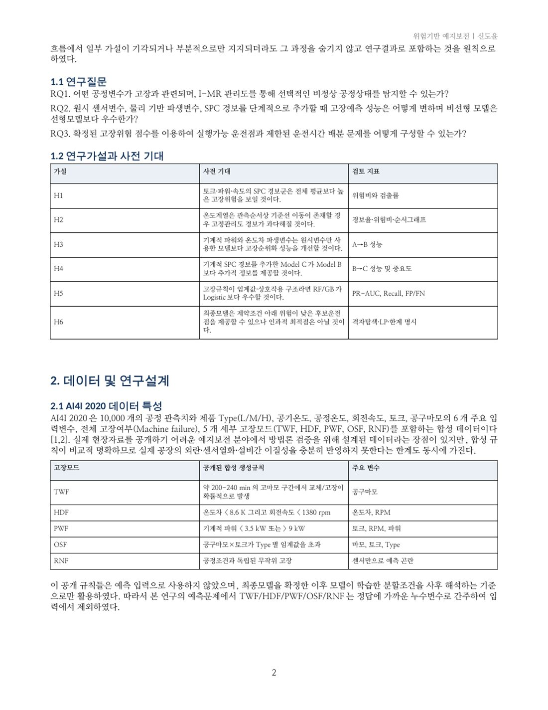

## 3쪽

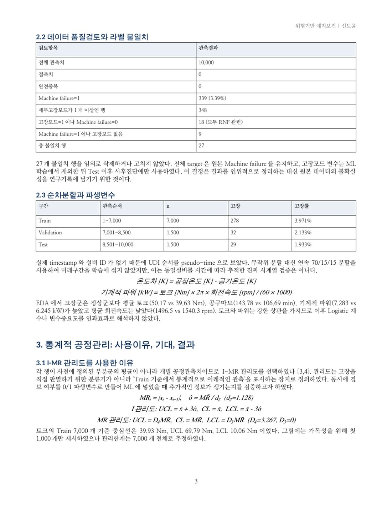

## 4쪽

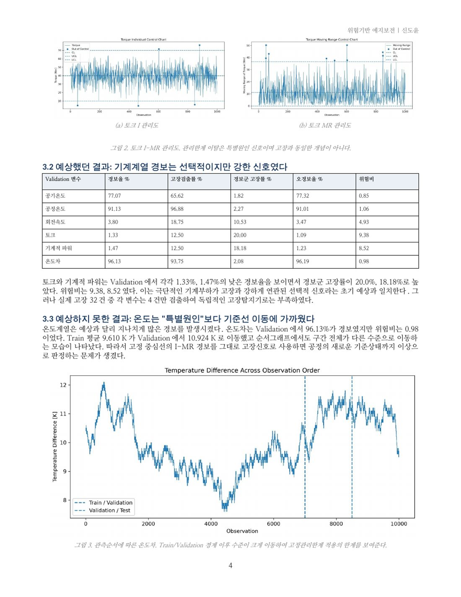

## 5쪽

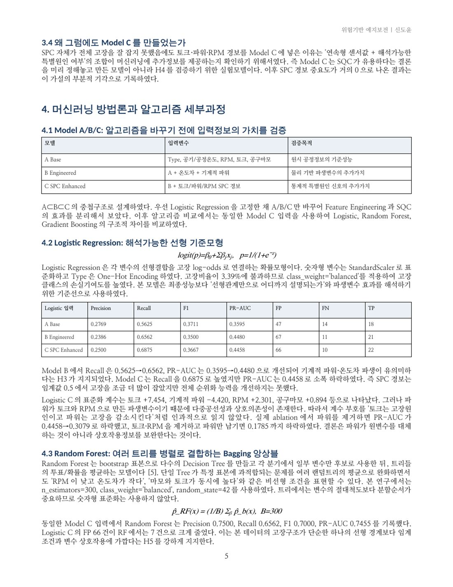

## 6쪽

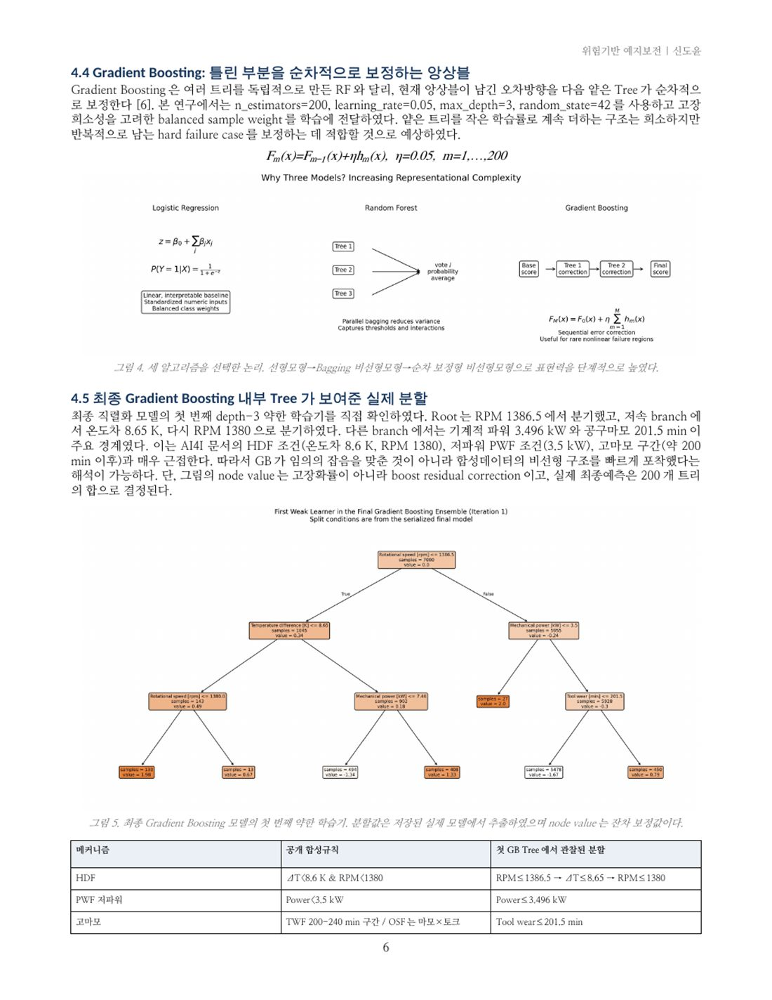

## 7쪽

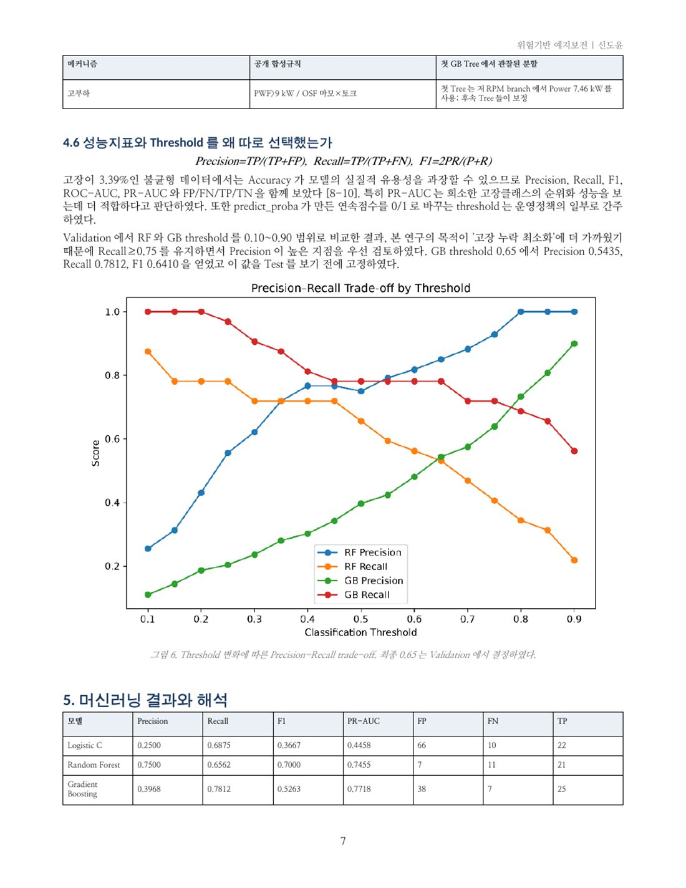

## 8쪽

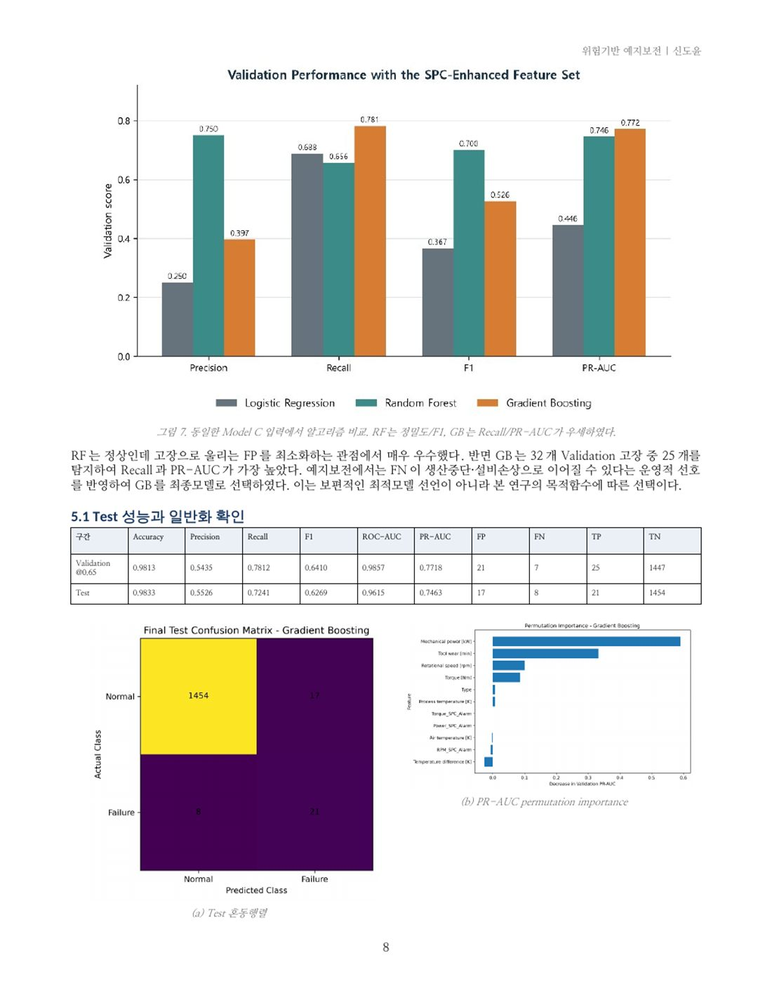

## 9쪽

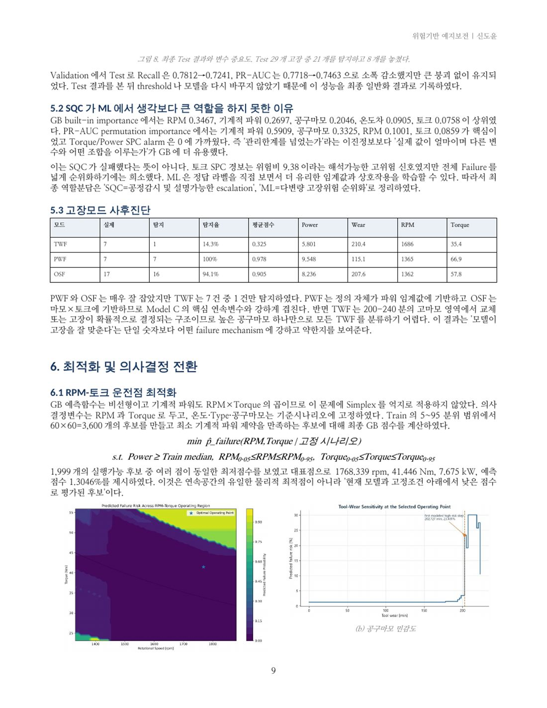

## 10쪽

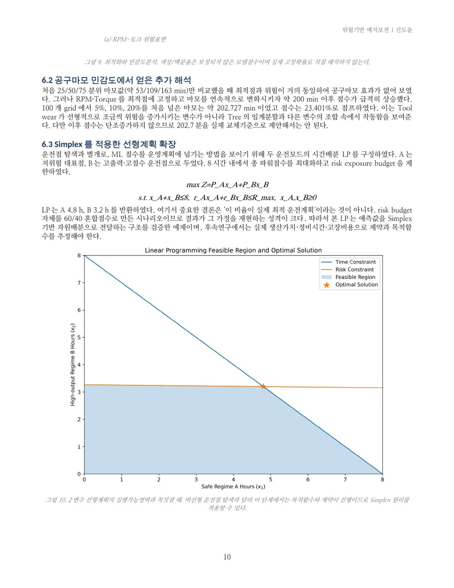

## 11쪽

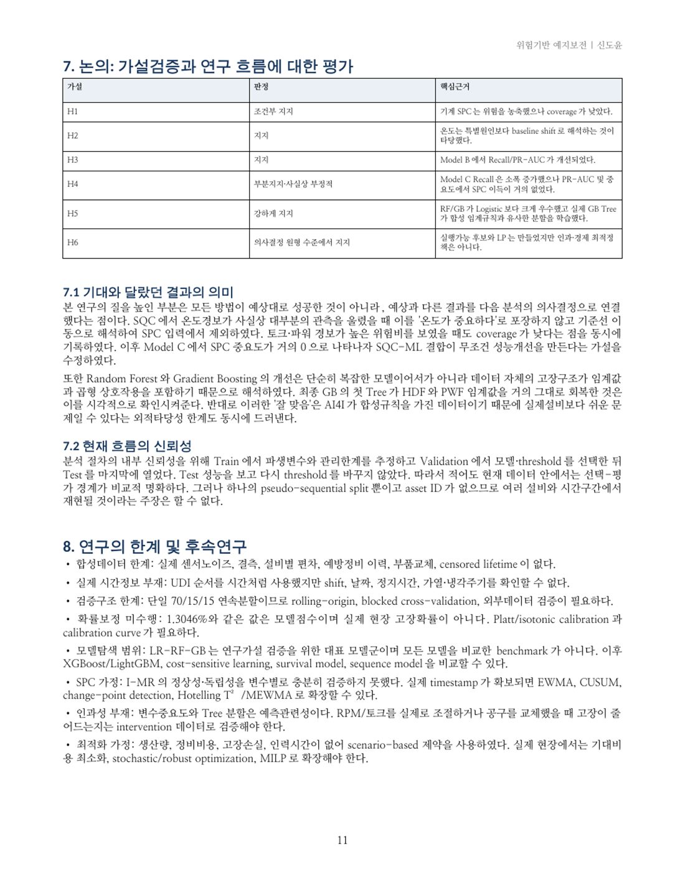

## 12쪽

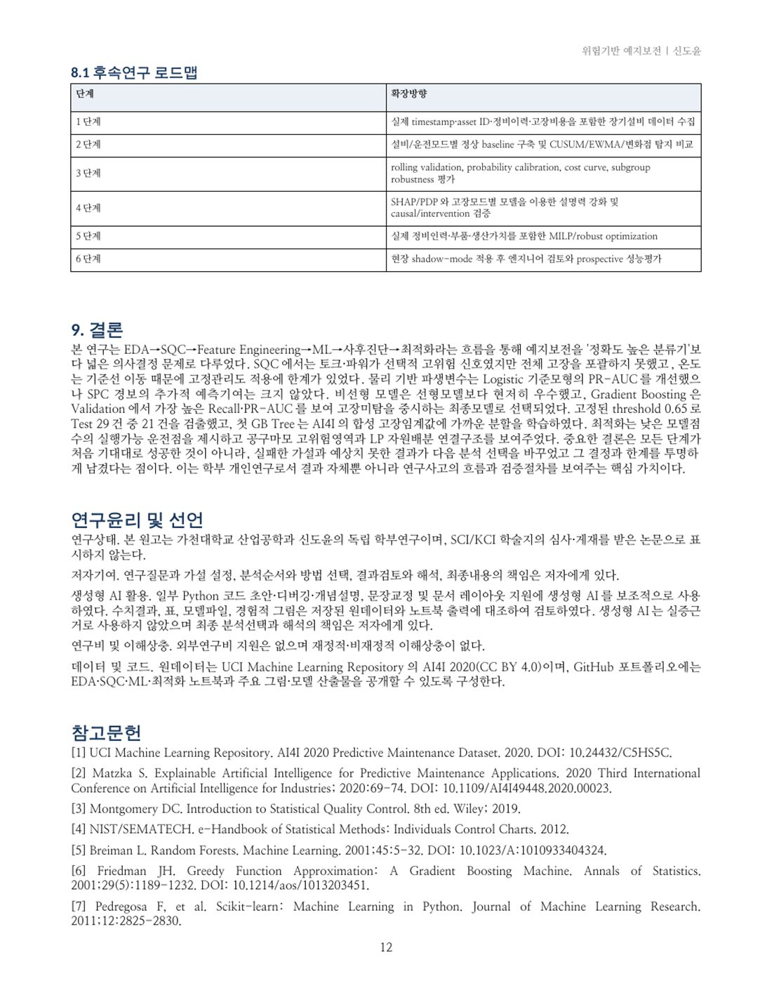

## 13쪽

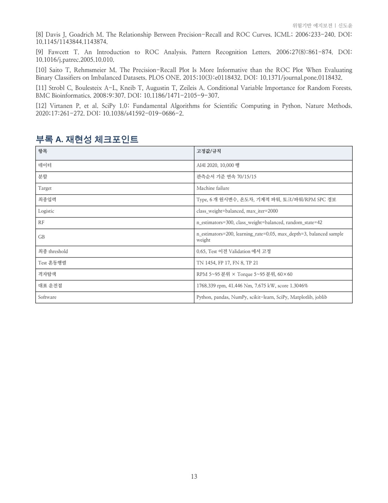

[맨 위로](#국문-논문--모바일-리더) · [원본 PDF 내려받기](https://github.com/doyunsin883-debug/risk-aware-predictive-maintenance-paper/releases/download/v1.0.0/risk-aware-predictive-maintenance-ko.pdf)
